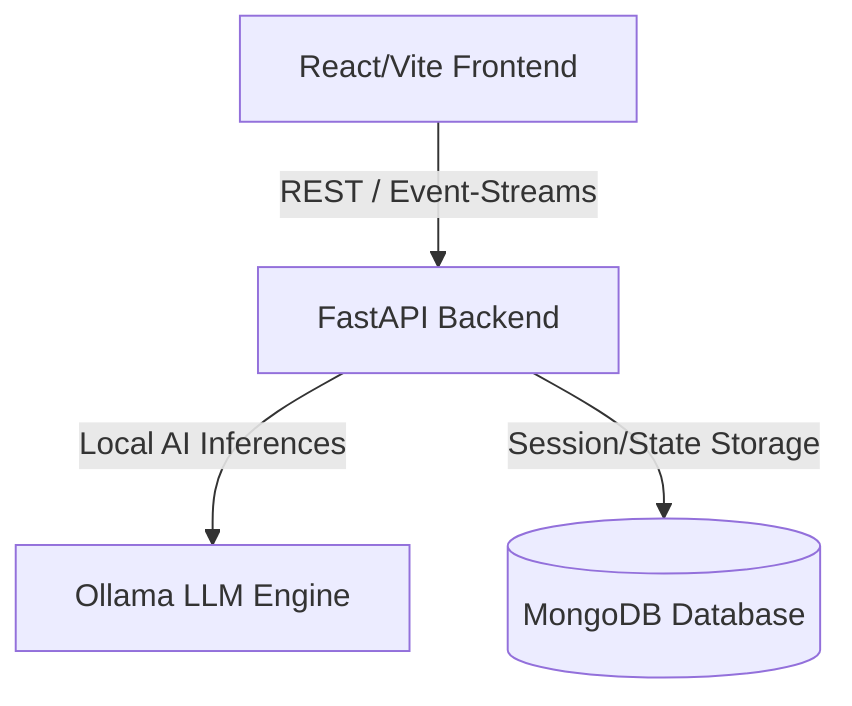

# High-Level System Architecture

This document details the design patterns, runtime environment, and architectural boundaries of the **AFK-Intelligence** local AI operating system.

## System Topology

AFK-Intelligence is structured as a two-tier decoupled system with a clean API boundary:

### 1. Frontend Client (React & Vite)
- Serves as the user interaction console.
- Connects to the backend via standard HTTP REST APIs and WebSockets/SSE (Server-Sent Events) for real-time log/event streaming.
- Manages local settings, styling/themes, and session configurations.

### 2. Backend Orchestration (FastAPI)
- Handles API routing, user session authentication, and runtime lifecycle hooks.
- Houses the multi-agent cognitive loop.
- Manages file indexing, AST scanners, code chunking, and memory retrieval.

### 3. Local LLM Service (Ollama)
- Coordinates all inference requests locally.
- Ensures user code, project details, and agent discussions never leave the host system.

---

## Architectural Philosophy

- **Zero-Cloud Dependency:** We optimize for local hardware execution to guarantee privacy, custom offline access, and $0 resource cost.
- **Unified Event Pipelines:** All operations (such as code edits, tool invocations, and thinking tasks) are treated as event streams that are stored in the database and simultaneously streamed back to the frontend.
- **Safety First:** Terminal commands and unsafe actions pass through a human-in-the-loop approval gate.
