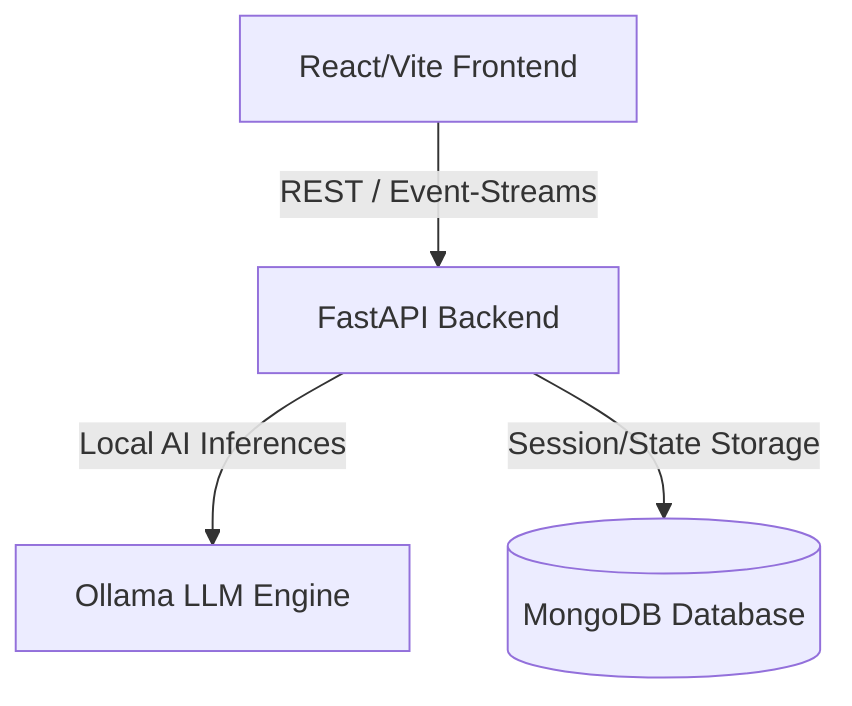

# High-Level System Architecture

This document details the design patterns, runtime environment, and architectural boundaries of the **AFK-Intelligence** local AI operating system.

## System Topology

AFK-Intelligence is structured as a two-tier decoupled system with a clean API boundary:

### 1. Frontend Client (React & Vite)
- Serves as the user interaction console.
- Connects to the backend via standard HTTP REST APIs and WebSockets/SSE (Server-Sent Events) for real-time log/event streaming.
- Manages local settings, styling/themes, and session configurations.

### 2. Backend Orchestration (FastAPI)
- Handles API routing, user session authentication, and runtime lifecycle hooks.
- Houses the multi-agent cognitive loop.
- Manages file indexing, AST scanners, code chunking, and memory retrieval.

### 3. Local LLM Service (Ollama)
- Coordinates all inference requests locally.
- Ensures user code, project details, and agent discussions never leave the host system.

---

## Architectural Philosophy

- **Zero-Cloud Dependency:** We optimize for local hardware execution to guarantee privacy, custom offline access, and $0 resource cost.
- **Unified Event Pipelines:** All operations (such as code edits, tool invocations, and thinking tasks) are treated as event streams that are stored in the database and simultaneously streamed back to the frontend.
- **Safety First:** Terminal commands and unsafe actions pass through a human-in-the-loop approval gate.

---

## System Components & Mechanics

### 1. Safety Gatekeeper (`RiskClassifier`)
Terminal commands requested by agents are classified into four risk levels before execution:
- **LOW:** Safe read-only commands (e.g., `ls`, `dir`, `pwd`, `git status`, `git log`, `git show`, `git branch`, `git diff`). These bypass human-in-the-loop approval.
- **MEDIUM:** Project-local mutations (e.g., installing packages, running tests). Requires confirmation.
- **HIGH:** Dangerous or system-altering actions (e.g., file deletion, Git resets). Requires strict confirmation.
- **CRITICAL:** Forbidden root/system command patterns (e.g., `sudo`, disk partitioning). Blocked immediately.

### 2. Terminal Sandbox (`TerminalSandbox`)
Maintains a stateful simulated shell runtime:
- **Stateful Directory Tracking:** Intercepts `cd` commands internally to track current working directories.
- **Path-Traversal Protection:** Ensures the destination of any `cd` operation resolves strictly inside the workspace root, preventing directory traversal attacks or unauthorized file-system escapes.

### 3. High-Reliability Code Rollbacks (`RollbackManager`)
Maintains local directory snapshots under `.afk_backups`:
- **Nested Directory Preservation:** Backs up changed files retaining their exact subdirectory path structure relative to the workspace root.
- **State Restoration:** Restores files on rollback to their original nested subfolders, ensuring workspace state integrity is cleanly preserved.

### 4. Dependency & AST Graph Scanner (`GraphExtractor`)
Statically extracts codebase semantics to build a directed graph of workspace components:
- **Entity Representation:** Files, classes, and functions are represented as nodes.
- **Relationship Scanning:** Identifies imports, file containment, module calls, and **class inheritance (`inherits`)** hierarchies to mapped symbols.
