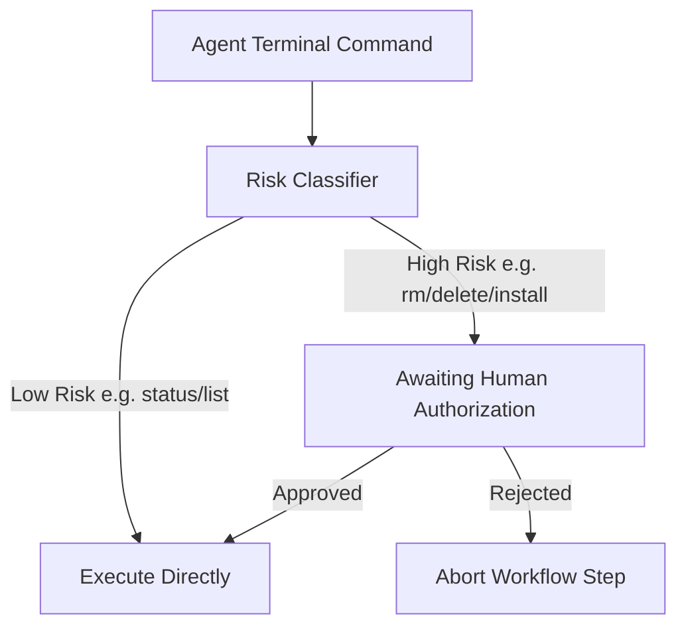

# Code Execution Safety & Approval Gates

This document outlines the safety measures, sandbox environments, and approval processes enforced when executing terminal commands or modifying project files.

## 1. Safety Guardrails

Because the agent can perform terminal executions (e.g. running scripts, launching servers), AFK-Intelligence uses a multi-tier risk classification engine to inspect commands.

---

## 2. Risk Classification (`risk.py`)

Every command is statically scanned before execution:
- **`LOW_RISK`**: Read-only queries like `git status`, `ls`, `git diff`, `echo`, or project build checks. These run without manual approval.
- **`MEDIUM_RISK`**: Includes standard compiler/build commands like `npm run build` or file modifications.
- **`HIGH_RISK`**: Commands containing patterns like `rm -rf`, `docker-compose down`, global installations (`npm install -g`), or force pushes. These strictly block execution until the user manually clicks "Approve" in the dashboard.
- **`CRITICAL_RISK`**: Highly dangerous system-level operations such as `sudo`, `dd`, `rmdir`, `mkfs`, or `shutdown`. These are strictly blocked and cannot be executed even with approval.

---

## 3. Human-In-The-Loop Approval (`manager.py`)

When a high-risk tool execution is requested:
1. The orchestrator pauses the workflow.
2. Yields a real-time `TOOL_CALL` event to the frontend client via Server-Sent Events (SSE).
3. The UI renders a modal highlighting the command, the agent's explanation, and the risk classification.
4. If approved, the socket returns a confirmation and execution resumes. If rejected, the workflow step is aborted safely.

### Policy: Whitelisted Sandbox Commands
The sandbox permits basic commands: `ls`, `dir`, `git status`, `git log`, `npm list`, `pip list`, `python --version`, and core read-only git operations.

### Policy: Blacklisted Destructive Operations
Commands matching `rm`, `del`, `format`, `mkfs`, redirection to dev directories, or prefix commands like `sudo` are strictly blocked immediately.

### Monitoring: Execution Duration Tracking
The TerminalSandbox measures execution time for every command run, logging values in the history records to flag slow processing steps.

### Security: Path Traversal Safeguards
When changing directories (`cd`), the target path is resolved to its absolute path. The sandbox verifies it lies strictly within the project workspace.

### Safety: Approval Workflows
Commands classified as `MEDIUM` or `HIGH` risk trigger an approval requirement, pausing execution until the operator clicks approve in the UI.